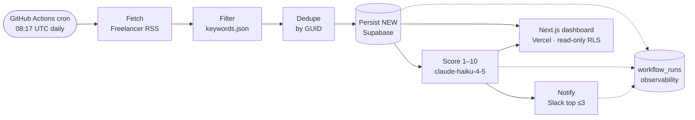

# PulseFlow

Code-first workflow orchestration that replaces one Zapier-class workflow: a daily freelance-market job hunt. A GitHub Actions cron fetches new Freelancer.com postings, filters them against a configurable keyword list, scores each 1–10 with `claude-haiku-4-5`, and posts the top matches to Slack — with a public dashboard for run history and scores. Zero infrastructure cost; the only spend is Anthropic API usage (well under $1/month at Haiku pricing).

**Live dashboard:** https://pulseflow-xi.vercel.app

## Architecture



Dedupe runs **before** scoring so the LLM never re-scores a job it has already seen. A three-status enum (`NEW → SCORED → NOTIFIED`) is the only idempotency mechanism — staleness and give-up states are *derived*, never stored. Data capture never depends on the LLM: rows are persisted `NEW` immediately, and scoring works off a database query, so an Anthropic outage degrades gracefully (exit 0) and the next run picks up the leftovers. Fetch or Supabase failures fail red (exit 1) — broken plumbing must be visible.

See [docs/ARCHITECTURE.md](docs/ARCHITECTURE.md) for the full pipeline, limitations, and scaling path.

## Stack

Python 3.13 · Pydantic v2 · httpx · feedparser · Anthropic SDK (`messages.parse` structured output) · Supabase (Postgres + RLS) · GitHub Actions · Next.js (App Router, ISR) on Vercel · Slack incoming webhook. Tooling: `uv` with a committed lockfile.

## Setup

Everything runs on free tiers. The pipeline needs four secrets; the dashboard needs two public env vars.

1. **Supabase** — create a project, run [`db/schema.sql`](db/schema.sql) in the SQL editor (creates `jobs` + `workflow_runs` with RLS: anon can read, only the secret key writes).
2. **Secrets** — set as GitHub Actions repository secrets (and locally in `.env`, which is gitignored):
   - `ANTHROPIC_API_KEY`, `SUPABASE_URL`, `SUPABASE_SECRET_KEY` (`sb_secret_…`), `SLACK_WEBHOOK_URL`
3. **Dashboard** — deploy `dashboard/` to Vercel with `NEXT_PUBLIC_SUPABASE_URL` and `NEXT_PUBLIC_SUPABASE_PUBLISHABLE_KEY` (`sb_publishable_…`, safe by RLS design).
4. **Run it** — `gh workflow run daily-hunt.yml` (or wait for the 08:17 UTC cron).

Local development:

```bash
uv sync
uv run pytest -q
uv run python scripts/run_hunt.py --dry-run   # fetch/filter/score, no DB or Slack
```

Configuration lives in [`config/keywords.json`](config/keywords.json) — feed URLs, filter keywords, `min_score`, heartbeat toggle, and the per-run scoring cap. Nothing is hardcoded.

## Honest caveats

This is a personal-use tool built with production discipline, not a SaaS. The limitations are real and documented rather than hidden:

- **GitHub Actions cron is best-effort.** Scheduled runs are delayed under load and on-the-hour ticks are sometimes dropped entirely — hence the off-peak `17 8 * * *` minute. A missed tick just means that day's hunt doesn't run; the next one does.
- **60-day inactivity auto-disable.** GitHub disables scheduled workflows in repos with no activity for 60 days. The workflow re-enables itself on every run (`gh api -X PUT …/enable`) — this resets the timer while alive, but it cannot self-heal once already disabled.
- **Supabase free-tier pause cascade.** A free project pauses after ~7 days of no traffic; the daily run is itself the keepalive. If Actions stops, Supabase eventually pauses and the dashboard shows a "data source unreachable" state (by design — a paused DB is not a broken portfolio page).
- **API-credit mortality.** If Anthropic credits run out, scoring degrades (jobs stay `NEW`, exit 0) and the daily Slack heartbeat shows `scored 0` for consecutive days — visible within 24 hours.
- **Freelancer keyword matching is narrow.** The feed's own keyword search is literal (`nextjs` returns 0 while `react` returns 20), so feed keywords are deliberately broad and the precise filtering happens locally against `keywords.json`.

## License

MIT © Sheharyar Ahmed
